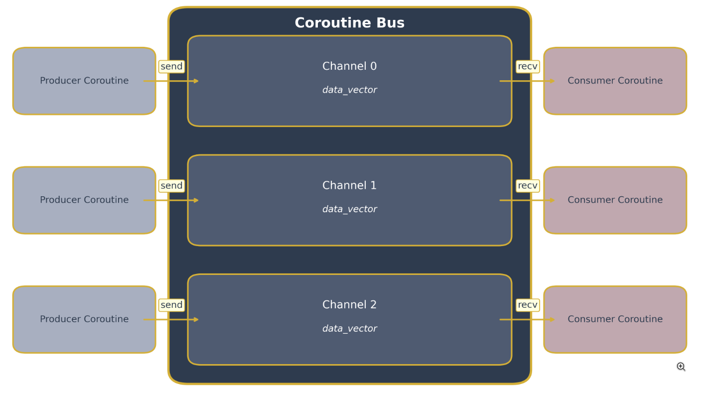

# CoroBus: A Coroutine‑Friendly Message Bus in C

CoroBus is a lightweight, high‑performance message bus library for C, designed to integrate seamlessly with user‑space coroutines (green threads). It allows multiple coroutines within a single OS thread to communicate through typed channels supporting blocking and non‑blocking operations, broadcast semantics, and bulk (vectorized) send/receive—all without relying on kernel‑level threading or synchronization primitives.

## Overview



Traditional thread‑based concurrency in C relies on kernel threads and heavyweight synchronization primitives such as mutexes and condition variables. Coroutines, in contrast, offer fine‑grained cooperative multitasking within a single OS thread, minimizing context‑switch cost and avoiding data races when used correctly.

CoroBus provides a channel abstraction familiar to Go developers, adapted for a C environment with custom coroutine support. Each channel maintains an internal FIFO queue of unsigned integer messages, enforces a size limit for backpressure, and orchestrates suspension and resumption of coroutines when channels are empty or full. Bonus features include:

* **Broadcast**: Atomically deliver one message to every open channel, blocking until all channels have capacity.
* **Batch operations**: Efficiently send or receive multiple messages in a single call, with both blocking and non‑blocking variants.

## Architecture and Design

At its core, the library defines two main types: `struct coro_bus` and `struct coro_bus_channel`. A bus can host an arbitrary number of channels, each identified by an integer descriptor. Internally, each channel holds:

1. A fixed-size FIFO buffer of messages.
2. Two wait‑queues of suspended coroutines: one for senders blocked on a full channel, another for receivers blocked on an empty channel.

Operations are split into *try* (non‑blocking) and blocking variants. For example, `coro_bus_try_send` attempts to enqueue a message and returns immediately if the channel is full, while `coro_bus_send` suspends the invoking coroutine until space becomes available or the channel is closed. Under the hood, blocking functions repeatedly invoke their non‑blocking counterparts, suspending the coroutine on `CORO_BUS_ERR_WOULD_BLOCK` and reattempting when signaled.

Broadcast and batch operations extend this model. `coro_bus_broadcast` ensures a message is enqueued in every channel atomically, suspending until all have room. Vectorized functions like `coro_bus_send_v` and `coro_bus_recv_v` loop over individual messages, interleaving coroutine suspension and wake‑ups to avoid monopolizing capacity and preventing deadlocks.

## Start

### Prerequisites

* A POSIX‑compliant system (Linux, macOS).
* A modern C compiler supporting C99 or later (GCC, Clang).
* No external dependencies beyond the provided `rlist` utility and the coroutine engine (`libcoro`).

### Building the Library and Tests

Clone the repository and invoke your preferred build system. A simple `Makefile` is included for convenience:

```bash
$ git clone https://github.com/your‑username/corobus.git
$ cd corobus
$ make           # compiles corobus.c, libcoro.c, and all tests
```

### Running the Test Suite

The project includes a comprehensive set of unit tests covering basic send/receive, blocking behavior, broadcast semantics, and batch operations under stress. After building:

```bash
$ ./test  # runs all tests and prints OK or diagnostics
```
Memory leaks are detected using `utils/heap_help/heap_help.c` library included in the project.

## Usage Example

Example, how to send and receive messages in two coroutines:

```c
#include "libcoro.h"
#include "corobus.h"

void *producer(void *arg) {
    struct coro_bus *bus = arg;
    for (unsigned i = 0; i < 100; ++i) {
        coro_bus_send(bus, 0, i);
    }
    return NULL;
}

void *consumer(void *arg) {
    struct coro_bus *bus = arg;
    unsigned x;
    for (int i = 0; i < 100; ++i) {
        coro_bus_recv(bus, 0, &x);
        printf("Consumed: %u\n", x);
    }
    return NULL;
}

int main(void) {
    coro_sched_init();
    struct coro_bus *bus = coro_bus_new();
    int chan = coro_bus_channel_open(bus, 16);

    coro_new(producer, bus);
    coro_new(consumer, bus);
    coro_sched_run();

    coro_bus_delete(bus);
    coro_sched_destroy();
    return 0;
}
```

This snippet creates a bus, opens a channel with capacity 16, and spawns a producer and consumer coroutine. The scheduler runs both until completion, ensuring all 100 messages are correctly transferred.

## Contributing

Contributions are welcome ;)